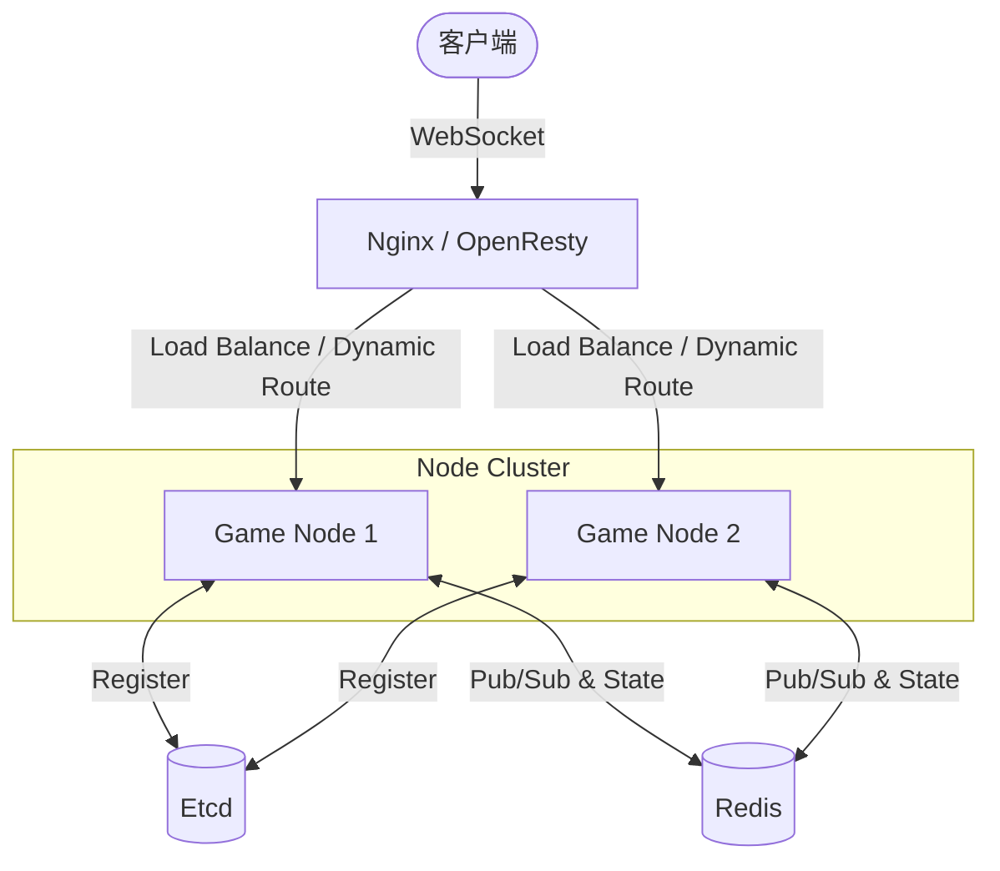
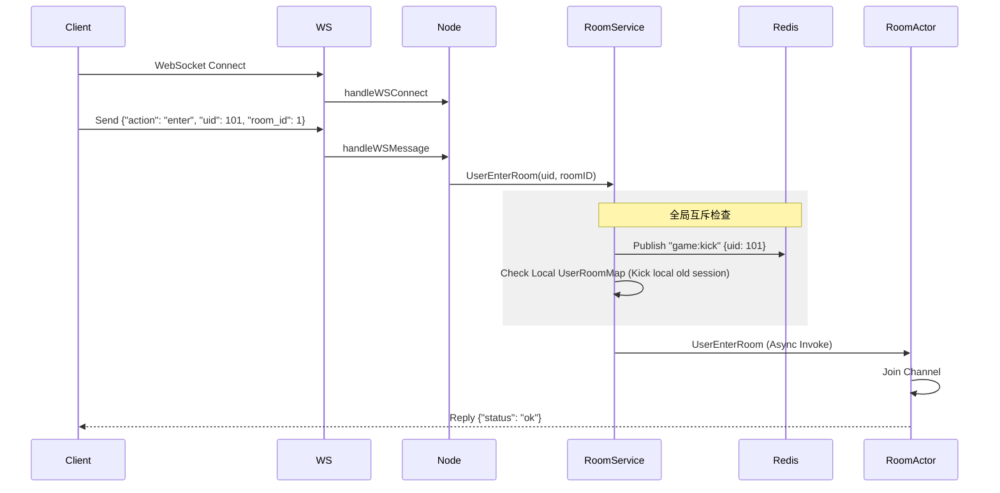
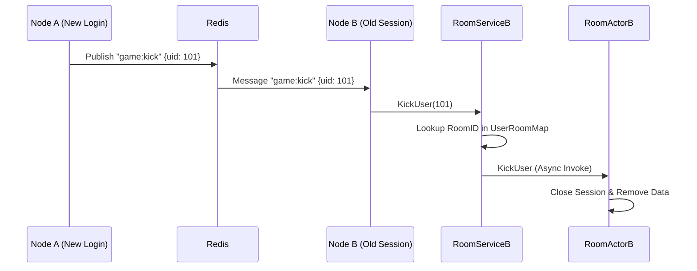
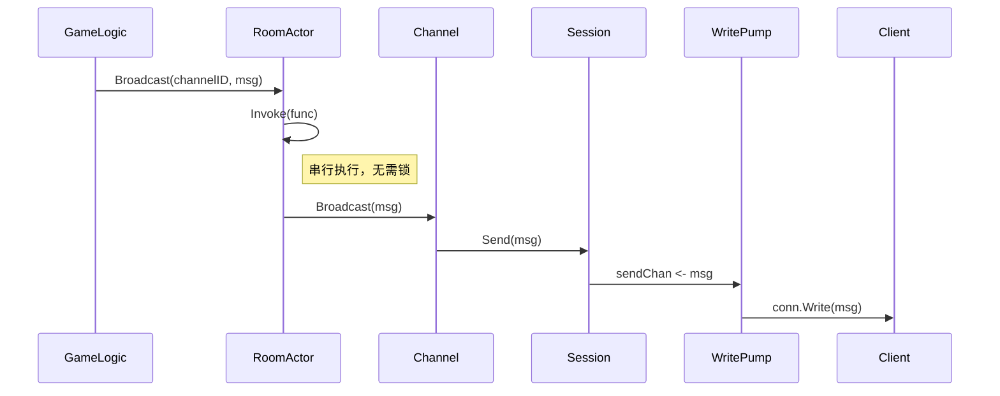

# Game Actor Framework

Game Actor 是一个基于 Go 语言的高性能、可扩展的游戏服务器框架，采用 Actor 模型来管理游戏房间逻辑，支持分布式部署、服务发现和无缝扩容。

## 1. 系统架构 (System Architecture)

系统整体采用分布式无状态节点设计，通过 Etcd 进行服务发现，Redis 进行节点间通信和动态路由支持。



## 2. 核心组件 (Core Components)

### 2.1 Node (节点)
*   **作用**: 服务的容器和入口，负责组装各个组件。
*   **职责**:
    *   启动 WebSocket 服务。
    *   初始化 `RoomService`。
    *   连接 Redis 和 Etcd。
    *   监听 Redis `game:kick` 频道，处理全局踢人逻辑。
    *   将网络层消息路由到业务层。

### 2.2 GameService / RoomService (服务层)
*   **作用**: 游戏房间的管理 SDK，负责全局（节点级）的房间调度。
*   **职责**:
    *   **房间管理**: 创建、销毁、查找房间 (`Rooms` Map)。
    *   **用户映射**: 维护 `uid -> roomID` 的映射 (`UserRoomMap`)，用于快速定位用户所在的房间。
    *   **生命周期**: 使用 `gocron` 管理房间的自动开始 (`MaxPlayerWaitTime`) 和自动关闭 (`MaxGameTime`)。
    *   **互斥逻辑**: 处理用户进入房间时的互斥逻辑（如踢出旧房间）。

### 2.3 GameRoom / RoomActor (逻辑层)
*   **作用**: 具体游戏逻辑的载体，采用 Actor 模型保证线程安全。
*   **职责**:
    *   **Actor 模型**: 通过 `go-actor` 库实现，所有逻辑（进入、离开、广播）都在单一 Goroutine 中串行执行，无需加锁。
    *   **频道管理**: 内置 `Channel` 机制，支持按频道 ID（如队伍、全房间）进行广播。
    *   **会话管理**: 持有用户的 `Session`，负责消息发送。

### 2.4 WebSocket (网络层)
*   **作用**: 处理客户端长连接。
*   **职责**:
    *   **连接升级**: 将 HTTP 升级为 WebSocket。
    *   **读写分离**: 
        *   **读**: 阻塞读取客户端消息并回调 Node。
        *   **写**: 每个 Session 维护一个 `writePump` Goroutine 和 `sendChan`，实现异步发送，防止网络阻塞影响 Actor 逻辑。

### 2.5 Redis (中间件)
*   **作用**: 分布式协调和数据存储。
*   **职责**:
    *   **全局踢人**: 利用 Pub/Sub (`game:kick`) 实现跨节点踢人。当用户在 Node A 登录时，Node A 发布消息，Node B 收到后强制断开该用户在 Node B 的旧连接。
    *   **动态路由**: 配合 OpenResty，根据 Redis 中的节点负载或特定规则（如 `room_id` hash）将流量转发到指定节点。

## 3. 核心流程 (Core Workflows)

### 3.1 用户进入房间流程 (User Enter Room)



### 3.2 全局踢人流程 (Global Kick)



### 3.3 消息广播流程 (Broadcast)



## 4. 目录结构 (Directory Structure)

```
game_actor/
├── cmd/                # 入口文件 (main.go)
├── discovery/          # 服务发现 (Etcd)
├── match/              # 匹配相关结构定义
├── network/            # 网络层 (WebSocket)
├── node/               # 节点层 (GameNode)
├── room/               # 房间逻辑 (BaseRoom, RoomActor, Channel)
├── service/            # 服务层 (RoomService)
├── session/            # 会话定义
├── go.mod              # 依赖管理
└── README.md           # 说明文档
```
