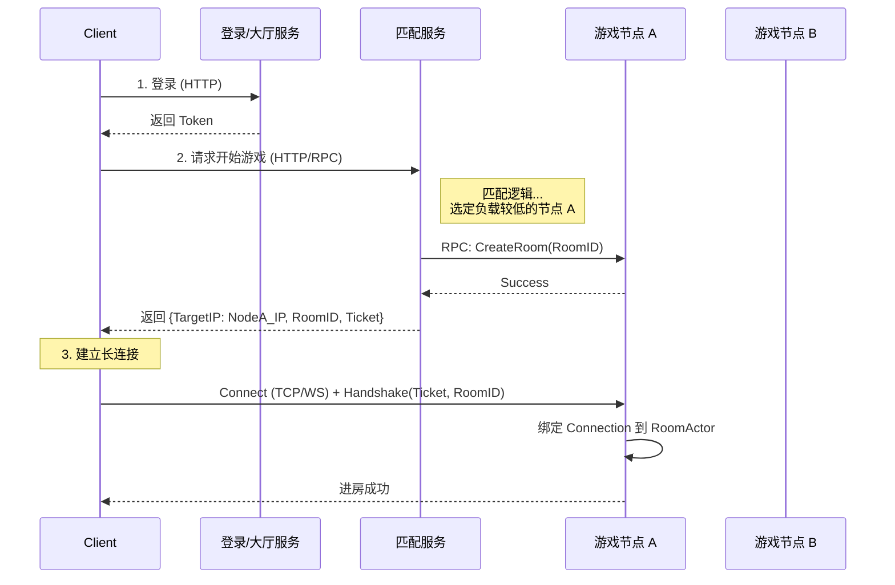

# 游戏服务器架构设计：长连接与多节点部署方案

本文档针对 `game_actor` 框架，回答关于长连接时机、频道广播及多节点部署的三个核心问题。

## 核心设计原则

为了实现 **“同一个房间的用户在同一个节点”**（Stateful / Sticky Session），我们推荐采用 **调度分配 + 直连（或网关透明路由）** 的架构。

这种架构利用了 Actor 模型的优势：一个房间就是一个 Actor，维护在内存中。为了最高效的通信，我们需要确保该房间的所有玩家都“连接”到持有该 RoomActor 的服务器节点上。

---

## 1. 用户建立长链接的时机

**结论：** 用户建立长连接的最佳时机是在 **匹配成功/房间创建成功** 之后。

### 推荐流程（动态节点分配）

如果不使用统一的长连接网关，而是让客户端直连逻辑节点，流程如下：

1.  **登录阶段 (HTTP)**：用户登录，获取 Token。
2.  **匹配阶段 (HTTP/RPC)**：
    *   用户向 **匹配服务 (Match Service)** 发起请求。
    *   匹配服务完成匹配后，通过 **服务发现 (Service Discovery)** 选择一个负载较低的 **游戏节点 (Game Node)**。
    *   匹配服务通过 RPC 在该节点上预创建房间 (`RoomService.CreateRoom`)。
    *   匹配服务将该 **游戏节点的地址 (IP:Port)** 和 **RoomID** 返回给客户端。
3.  **连接阶段 (TCP/WebSocket)**：
    *   客户端断开可能存在的旧连接（如在大厅的连接）。
    *   客户端根据返回的 IP:Port，**发起新的长连接**。
    *   连接建立后发送 `JoinRoom` 协议（携带 Token 和 RoomID）。

### 流程图



---

## 2. 如何维护频道与广播

由于采用了上述的“同节点”策略，房间内的所有用户连接都在同一个进程（节点）内，频道的维护变得非常简单且高效。

### 频道维护机制
在 `RoomActor` 中，我们需要维护一个 `Session` 列表。由于是 Actor 模型，甚至不需要加锁（如果逻辑都在 Actor 的 goroutine 里跑）。

*   **数据结构**：在 `BaseRoom` 或 `RoomActor` 中增加 `sessions map[int64]NetworkSession`。
*   **加入频道**：当 `UserEnterRoom` 被触发且连接握手成功时，将用户的连接对象（Session）存入 map。
*   **退出频道**：当 `UserLeaveRoom` 或连接断开时，从 map 中移除。

### 广播实现
广播即遍历 map 发送数据。

```go
// 伪代码示例
func (r *RoomActor) Broadcast(msg []byte) {
    for uid, session := range r.sessions {
        // 这里的 Send 应该是异步非阻塞的，避免某个客户端卡死导致 Actor 阻塞
        session.Send(msg) 
    }
}
```

### 如果必须跨节点（扩展情况）
如果架构演进为 **网关(Gateway) + 逻辑(Logic)** 分离模式，且不强制用户连接特定网关：
1.  **Pub/Sub**：引入 Redis 或 NATS。
2.  **订阅**：网关节点订阅 `channel_room_{roomID}`。
3.  **发布**：逻辑节点的 `RoomActor` 将消息 Publish 到 `channel_room_{roomID}`。
4.  **推送**：网关收到消息后，下发给连接在该网关上的对应用户。

*但在本项目初期，强烈建议使用 **客户端直连逻辑节点** 的方式，架构最简单，延迟最低。*

---

## 3. 多节点部署的问题该如何解决

多节点部署的核心在于 **服务发现** 和 **状态路由**。

### 关键组件

1.  **注册中心 (Etcd / Consul / Zookeeper)**：
    *   每个 Game Node 启动时，将自己的 **公网 IP**、**端口**、**当前负载（房间数/人数）** 注册到注册中心。
    *   定期发送心跳续期。

2.  **调度/匹配服务 (Matchmaker)**：
    *   监控注册中心，维护所有健康的 Game Node 列表。
    *   **调度策略**：当需要创建新房间时，选择一个节点（如：Least Connection 策略，或 Hash 策略）。
    *   **路由**：告诉客户端去连哪个节点。

### 部署架构图

```mermaid
graph TD
    UserA[用户 A]
    UserB[用户 B]
    
    subgraph "Service Discovery"
        Etcd[Etcd / Consul]
    end

    subgraph "Control Plane"
        Match[匹配服务]
        Match -.->|Watch| Etcd
    end

    subgraph "Game Cluster"
        Node1[Game Node 1]
        Node2[Game Node 2]
        Node3[Game Node 3]
        
        Node1 -.->|Register| Etcd
        Node2 -.->|Register| Etcd
        Node3 -.->|Register| Etcd
    end

    UserA -->|1. Request Match| Match
    Match -->|2. Assign Node 1| UserA
    UserA -->|3. Connect (TCP)| Node1
    UserB -->|3. Connect (TCP)| Node1
    
    NoteNode[Node 1 内部运行 RoomActor<br/>A 和 B 都在此节点的内存中]
```

### 解决多节点常见问题

1.  **节点宕机怎么办？**
    *   由于是 Stateful 服务，节点宕机意味着内存中的房间状态丢失。
    *   **处理**：客户端断开连接 -> 重新请求匹配 -> 匹配服务分配新的节点 -> 重新开始游戏（或从数据库恢复存档，如果是长程游戏）。对于 MOBA/FPS 等短局制游戏，通常直接判局结束。

2.  **如何扩容？**
    *   启动新的 Game Node 进程。
    *   新节点自动注册到 Etcd。
    *   匹配服务感知到新节点，开始往新节点分配房间。

3.  **用户断线重连？**
    *   客户端本地缓存 `WaitRoomID` 和 `TargetNodeAddr`。
    *   重连时直接连回原节点。
    *   或者：请求匹配服务接口 `GetRunningRoom`，匹配服务查询 Redis（存储 RoomID -> NodeIP 映射），返回原节点地址。

## 4. Nginx 反向代理与内网 IP 暴露问题

如果你的架构中强制要求所有流量通过 Nginx 入口，且游戏节点部署在内网（Private IP），则不能直接暴露内网 IP。

### 核心思路：暴露 Nginx 的公网 IP + 路由标识

匹配服务（Matchmaker）不返回内网 IP，而是返回 **Nginx 的公网地址** 加上一个能让 Nginx 区分目标节点的 **标识**（端口号或 URL 路径）。

### 方案 A：基于 URL 路径的路由（推荐 WebSocket）

适用于 WebSocket 协议。

1.  **节点标识**：每个游戏节点启动时，生成一个唯一 ID（如 `node-01`）。
2.  **服务注册**：节点将 `{ID: "node-01", IP: "10.0.0.1:8080"}` 注册到 Etcd。
3.  **Nginx 配置**：Nginx 需要配置路由规则，将 `/ws/node-01/` 转发到 `10.0.0.1:8080`。
    *   *动态方案（推荐）*：使用 OpenResty (Lua) + Redis/Etcd，动态查询路由，无需重启 Nginx。
    *   *静态方案*：使用脚本生成 nginx.conf 并 reload。
4.  **客户端连接**：匹配服务返回 `wss://nginx-public.com/ws/node-01/`。

```nginx
# 静态配置示例
location /ws/node-01/ {
    proxy_pass http://10.0.0.1:8080;
    proxy_http_version 1.1;
    proxy_set_header Upgrade $http_upgrade;
    proxy_set_header Connection "Upgrade";
}
```

#### 进阶：OpenResty 动态路由（Zero-Config 扩容）

使用 OpenResty + Redis 实现无需重启 Nginx 的动态路由。

**原理**：
1.  **节点注册**：游戏节点启动时，将自己的 ID 和 IP 写入 Redis（Key: `node_route:{node_id}`, Value: `10.0.0.1:8080`）。
2.  **动态转发**：OpenResty 从 URL 解析出 `node_id`，查询 Redis 获取目标 IP，动态设置后端。

**Nginx 配置 (OpenResty)**:

```nginx
http {
    # 定义后端变量
    upstream backend_dynamic {
        server 0.0.0.1 down; # 占位符
        balancer_by_lua_block {
            local balancer = require "ngx.balancer"
            local redis = require "resty.redis"
            local red = redis:new()
            
            red:set_timeout(1000)
            local ok, err = red:connect("127.0.0.1", 6379)
            if not ok then
                ngx.log(ngx.ERR, "failed to connect to redis: ", err)
                return
            end
            
            -- 从 context 获取目标地址（由 access_by_lua 设置）
            local target_ip = ngx.ctx.target_ip
            local target_port = ngx.ctx.target_port
            
            if target_ip then
                local ok, err = balancer.set_current_peer(target_ip, target_port)
                if not ok then
                    ngx.log(ngx.ERR, "failed to set current peer: ", err)
                end
            end
        }
    }

    server {
        listen 80;
        
        # 匹配 /ws/{node_id}/
        location ~ ^/ws/([\w-]+)/ {
            set $node_id $1;
            
            access_by_lua_block {
                local redis = require "resty.redis"
                local red = redis:new()
                red:set_timeout(1000)
                local ok, err = red:connect("127.0.0.1", 6379)
                
                -- 查询 Redis: Key = "node_route:node-01"
                local res, err = red:get("node_route:" .. ngx.var.node_id)
                
                if not res or res == ngx.null then
                    ngx.status = 404
                    ngx.say("Node not found")
                    return ngx.exit(404)
                end
                
                -- 解析 IP:Port (假设存储格式为 "10.0.0.1:8080")
                local i, j = string.find(res, ":")
                ngx.ctx.target_ip = string.sub(res, 1, i - 1)
                ngx.ctx.target_port = tonumber(string.sub(res, j + 1))
            }
            
            proxy_pass http://backend_dynamic;
            proxy_http_version 1.1;
            proxy_set_header Upgrade $http_upgrade;
            proxy_set_header Connection "Upgrade";
        }
    }
}
```

**扩容流程**：
1.  启动新节点 `node-02` (IP: 10.0.0.2:9999)。
2.  `node-02` 往 Redis 写 `SET node_route:node-02 10.0.0.2:9999`。
3.  匹配服务返回 `wss://nginx-public.com/ws/node-02/`。
4.  OpenResty 自动转发，**无需修改任何配置，也无需 Reload**。

### 方案 B：基于端口映射（TCP/UDP Stream）

适用于 TCP/UDP 协议，使用 Nginx Stream 模块。

1.  **端口规划**：规划一段公网端口范围（如 10001-10100）映射到内网节点。
2.  **Nginx 配置**：
    *   公网 `10001` -> 内网 `10.0.0.1:8080`
    *   公网 `10002` -> 内网 `10.0.0.2:8080`
3.  **匹配返回**：匹配服务知道这个映射关系（配置或约定），返回 `nginx-public.com:10001` 给客户端。

### 总结建议

*   如果是 **WebSocket**，使用 **OpenResty 动态路由** 是最优雅的方案，对外只暴露 443 端口。
*   如果是 **TCP**，使用 **Nginx Stream 端口映射**，需要管理好端口分配。

## 5. 总结

针对你的 `game_actor` 项目：

1.  **连接时机**：匹配完成后，根据返回的服务器地址建立连接。
2.  **频道维护**：在 `RoomActor` 内存中维护 `map[uid]Session`，直接遍历发送。
3.  **多节点**：引入 **服务注册发现**（推荐 Etcd 或 Consul），由匹配服务负责将房间分配到不同节点，并引导客户端连接。
4.  **Nginx 代理**：使用 URL 路径（WS）或端口映射（TCP）来隐藏内网 IP，匹配服务返回经过映射的公网地址。
